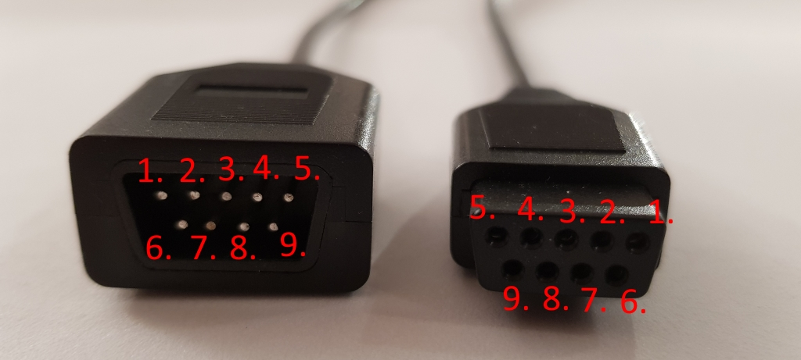

# Six button Sega Mega Drive controller board

This repository contains a KiCad project for a six button Sega Mega Drive / Genesis controller board as well as ATTiny404 micro controller code to implement a replacement for the 6 button Sega Mega Drive controller's custom chip. This board should also work with the ZX Spectrum Next.

**Note: the `main` HEAD is not necessarily tested! Tested revisions of the board+firmware will be tagged**

You can order the original, tested version of this board pre-assembled [here.](https://oshpark.com/shared_projects/aK2wBkfg)

The original version of this board used a 14-pin dual row header for the buttons because I was unaware of the brook 20 pin header at the time. I might add that pinout to future boards.

## How do I program the controller?

The ATtiny404 uses UPDI (Unified Program and Debug Interface) for programming, not ISP like older AVR MCUs. 

There are several ways to program the ATtiny404 but probably the most affordable way is to use **avrdude** with a USB serial adapter. serialupdi mode has been supported by **avrdude** since v7.

You will need the following:

* A USB serial adapter such as the [FTDI FT232](https://www.amazon.co.uk/dp/B07BBPX8B8)
* A 4.7 KOhm resistor. A resistor in the range of 3.3K to 10KOhm should be fine if you don't have a 4.7KOhm resistor.
* 5x female to female jumper (DuPont) wires.

The +5V and GND headers are wired directly from the serial adapter to the UPDI header. You must create a "Y" jumper cable that connects both the RX and TX pins on your serial adapter to the single UPDI pin on the controller PCB.

The UPDI pin is the bottom left UPDI header pin that has the square footprint in this schematic screenshot. The resistor needs to be connected to the TX wire of your Y cable. Ensure that your serial adapter voltage selection header is set to 5V.


You should only need to have the ATtiny and the UPDI header soldered to the PCB to program it.

Once you have the board connected as shown above, you can program the firmware under Linux using:

```
avrdude  -p t404 -c serialupdi -P /dev/ttyUSB0 -U flash:w:main.hex
```

Or under Windows:

```
avrdude.exe -p t404 -c serialupdi -P COM3 -U flash:w:main.hex
```

Make sure you set the serial port device correctly by checking **dmesg** output under Linux or **Device Manager** under Windows.

## How do I wire the cable?

The cable is connected to the J2 header using this pinout:



Pin 1 on J2 and all of the chips is marked on the PCB silkscreen with a small white dot to the side of pin 1.
